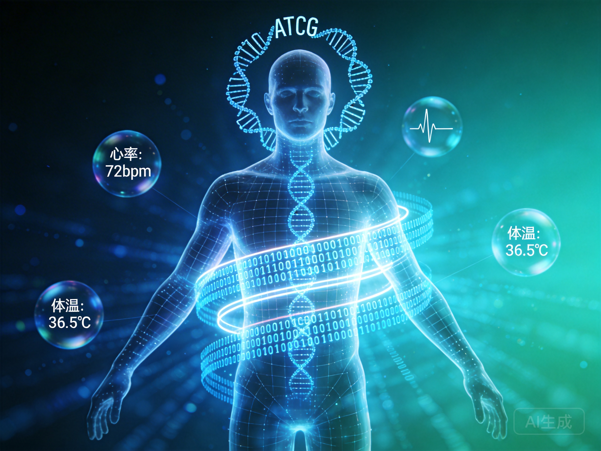

# 第一间奏：身体

*身体被数据环绕，成为算法分析的对象——2035年的体检已不再是简单的检查，而是全面的数字化扫描*

---

## 当我老了，躺在床上，谁来给我翻身？

---

那个能感知冷暖的载体，何时成了被优化的外设？

在算法重构一切的时代，我们正面临一个古老的悖论：身体既是我们最亲密的居所，又是我们最陌生的客体。

这不是哲学家的抽象思辨。这是正在发生的日常现实。

---

## 林娜的体检报告

让我们回到林娜。三个月后，她的年度全面体检报告出炉。不是那种简单的血压血糖检查，而是21世纪30年代的"全身数字化扫描"——从基因序列到肠道菌群，从脑电波模式到皮肤电阻变化，一切都被量化、评分、预测。

报告的第一页是一份"健康优化建议书"：根据她的基因型、生活方式、职业需求，系统建议她在未来五年内进行七项"预防性干预"——从营养补充方案到睡眠节律调整，从运动处方到社交频率建议。

林娜盯着报告，感到一种奇怪的疏离。这些数据描述的是"她"吗？还是只是她的"身体"，那个可以像机器一样被维护、升级、优化的物理载体？

报告的最后一行让她停住了："基于当前数据，您的预期寿命为87.3岁，健康调整寿命（HALE）为76.8岁。如需延长HALE，请参阅附件B的增强方案。"

健康调整寿命。这个词组本身就透露出一种新的人类观：寿命不再是给定的，而是可以被"调整"的。通过什么？通过优化，通过干预，通过将身体视为一个可以被工程化改造的系统。

---

## 【东西方：两种身体观】

### 西方的身体：机器与财产

在西方传统中，身体长期被视为灵魂的监狱（柏拉图），或者机器（笛卡尔）。这种二元论有一个实际的后果：身体是可以被拥有、被控制、被交易的客体。

**洛克**说：每个人对自己的人身享有一种所有权，除他以外任何人都没有这种权利。这是自由主义的基石——我的身体，我的财产，我的选择。

但这种"所有权"概念也意味着：身体可以被优化，就像财产可以被增值。如果有一种技术可以让身体更有效率、更耐用、更有生产力，为什么不采用？

**功利主义**进一步推进：如果增强技术可以提高整体福利，我们就应该推广它。身体的"自然性"没有内在价值，只有工具价值。

### 东方的身体：关系与场域

东方传统提供了不同的视角。在儒家思想中，身体不是孤立的个体，而是关系网络中的节点。我们的身体属于父母（"身体发肤，受之父母"），属于家族，属于社会。

**身体作为关系的媒介**：
- 我们通过身体来表达敬意（礼仪）
- 我们通过身体来承担责任（孝道）
- 我们通过身体来参与共同体（祭祀、节日）

在道家思想中，身体不是机器，而是"气"的流动，是自然的一部分。**顺应自然**不是放弃改善，而是认识到身体有其自身的节奏和智慧，不能被完全预测或控制。

中医的身体观更具体：身体是一个动态平衡的系统，健康不是消除所有问题，而是维持"阴阳平衡"。干预（药物、针灸）是辅助身体自愈能力，而不是取代它。

---

## 两种身体观的冲突

这两种身体观正在21世纪发生碰撞。

**基因编辑的伦理争论**：
- 西方：个人选择权——如果我愿意承担风险，为什么不能用CRISPR优化我的后代？
- 东方：代际责任——改变基因不仅关乎我，还关乎子孙，关乎人类基因库的完整性

**增强技术的可及性**：
- 西方：市场决定——谁买得起，谁就能增强
- 东方：社会公平——增强技术可能创造新的种姓制度，需要集体决策

**死亡的权利与义务**：
- 西方：死亡是个人的选择，应该被尊重
- 东方：死亡不仅是个人事件，还涉及家族、社会——"好死"是人生的完成

---

## 林娜的选择

回到林娜。报告附件B提出了一个"激进优化方案"：通过基因编辑和神经增强，她可以将HALE提高到82岁，但代价是某些"非必要"的认知功能——比如做梦的能力，或者某些类型的情感反应。

系统认为这是理性的选择：牺牲"低效"的功能，换取更多的"健康寿命年"。但林娜犹豫了。

她想起母亲。母亲去世前的那几年，虽然身体衰弱，但那些睡前的对话、那些断断续续的回忆、那些甚至不需要语言的陪伴——那些是"健康寿命年"吗？按照算法的标准，也许不是。但按照林娜的标准，那是人生最有意义的时光。

她也想起祖父。祖父的工厂生活充满了危险和辛苦，但那种身体的在场——肌肉的酸痛、机器的轰鸣、工友们共同完成一件大事的成就感——那种"沉重"的质感，是任何虚拟现实都无法复制的。

林娜最终拒绝了激进优化方案。她选择了一个折中的路径：接受部分建议，但保留那些算法认为是"低效"的人类特质。

这不是对技术的拒绝。这是对"什么值得被优化"的定义权的争夺。

---

## 身体作为边界

在AI时代，身体可能成为一种新的边界。

**不可被完全优化的领域**：
- 疼痛——不仅是一种信号，也是一种保护
- 疲劳——提醒我们休息的边界
- 死亡——给生命以有限性，从而赋予意义

这些"不完美"可能是人性的最后防线。如果一切都可以被优化，我们将失去什么？

**在场的能力**：
- 身体让我们能够"在场"——在场于某个地点、某段时间、某段关系
- 在场意味着不可替代性、不可复制性
- AI可以模拟在场，但无法真正在场

**脆弱性的价值**：
- 身体的脆弱性让我们需要彼此
- 需要被照护、需要照护他人，这是关系的基础
- 如果身体可以被完美维护，我们还需要彼此吗？

---

## 一个未解的问题

最后，让我们留下一个问题：

如果超级智能可以创造一个世界，在那里没有人需要承受身体的痛苦、衰老、死亡——那是一个更好的世界吗？

或者，那些"不完美"正是我们之所以为人的核心？

**此刻，请你选择**：

假设你可以选择：
- **A. 上传到云端**：摆脱身体限制，以纯意识形式永生
- **B. 保持肉身**：接受身体的局限，但保留完整的感官和情感体验
- **C. 增强身体**：通过技术大幅延长寿命和能力，但保持物理形态

你会选择哪一个？为什么？

这个问题没有标准答案。但它迫使我们思考：在算法可以优化一切的时代，什么是不应该被优化的？

现在，让我们回到主线，追问智能本身——那个正在重写一切规则的递归力量。