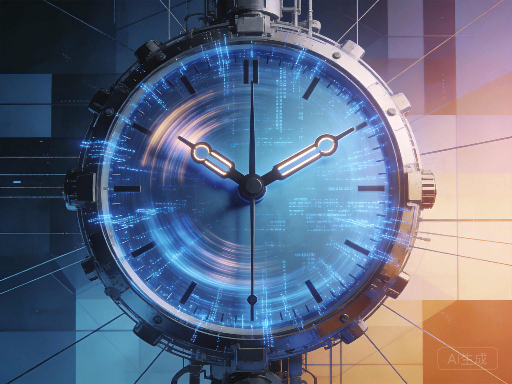

# 第二间奏：时间

*时钟指针快速与缓慢转动的对比——算法追求实时最优，人类需要"事缓则圆"的空间*

---

## 为什么我们省下了时间，却更没空了？

---

他们追求实时最优，我们曾相信"事缓则圆"

在算法以毫秒为单位重构世界的时代，那个需要发酵的"时间"，去哪里了？

这不是怀旧，这是生存的追问。

---

## 林娜的祖父

让我们离开林娜，去见她的祖父——海因里希·韦伯，82岁，住在柏林郊区的一栋老房子里。

海因里希每天的生活遵循着一种林娜难以理解的节奏。他早上六点起床，不是因为他被优化过，而是因为这是六十年来形成的习惯。他亲手煮咖啡，用那种需要十分钟才能煮沸的老式摩卡壶——林娜送的智能咖啡机被收在柜子里，"太快了，"他说，"没有味道。"

海因里希的一天充满了林娜认为的"低效"活动：他花一小时读报纸（纸质的那种），不是为了获取信息，而是"为了那个过程"；他花两小时在花园里，不是因为他需要那些蔬菜，而是"土地需要被照顾，我也需要照顾土地"；他每周三去那家土耳其餐厅，不是为了"社交配额"，而是因为"汉斯会迟到，这让我有时间观察街道上的变化"。

最让林娜困惑的是，海因里希似乎从不着急。即使当林娜告诉他，他的体检报告显示某些指标需要关注，他也只是点点头，说："我知道。但有些东西不能急。"

"什么东西？"

"身体有它自己的节奏，"海因里希说，"你越是想加速恢复，它就越是反抗。我们这一代人在工厂里学到了一件事：机器可以加速，但人不行。人需要时间——不是作为资源，而是作为...作为什么？"他停顿了一下，"作为存在的条件。"

---

## 【东西方：两种时间观】

### 西方的时间：资源与效率

在西方传统中，时间是线性的、可分割的、可量化的资源。**牛顿**的时间像一条河流，均匀流逝，可以被精确测量。**爱因斯坦**改变了我们对时间的理解，但在日常生活中，我们仍然活在牛顿的时间里——时钟、日程、截止日期。

**工业革命的遗产**：
- 时间成为商品，可以买卖（"时间就是金钱"）
- 效率成为美德（泰勒制、流水线）
- 未来优于现在（进步、发展、增长）

**现代性的时间焦虑**：
- 我们害怕"浪费时间"
- 我们追求"时间管理"
- 我们用"产出"来衡量时间的价值

### 东方的时间：节奏与时机

东方传统提供了不同的视角。**道家**的"无为"不是不作为，而是顺应自然的节奏。**儒家**的"时中"强调在正确的时间做正确的事。**佛教**的"当下"提醒我们，过去和未来都是幻象，只有此刻是真实的。

**中医的时间智慧**：
- 子午流注——身体的气血在不同时辰流经不同经络
- 顺应四时——春生、夏长、秋收、冬藏
- 不是对抗时间，而是与时间合作

**农业社会的时间遗产**：
- 时间由季节决定，不能加速
- 等待是必要的过程（播种、生长、收获）
- "事缓则圆"——有些事情需要时间发酵

---

## 算法的时间 vs 人类的时间

21世纪30年代，这两种时间观正在发生剧烈碰撞。

**林娜的体验**：
- 她的日程被AI优化，每一分钟都被安排
- 她"节省"了大量的时间——通勤时间（远程工作）、购物时间（自动配送）、决策时间（AI建议）
- 但她感到更忙、更焦虑、更没有时间

**悖论**：当我们用技术节省时间的工具越来越多时，我们感受到的时间压力却越来越大。

为什么？

### 算法的逻辑

算法优化的是"效率"——单位时间内的产出最大化。这个逻辑没有错误，但它有一个隐藏的前提：时间是资源，应该被充分利用。

当这个逻辑被推向极致：
- 睡眠被优化为恢复精力的最小必要时间
- 社交被优化为维持心理健康的最小必要互动
- 休闲被优化为恢复创造力的最小必要放松

一切都被"最小必要化"——除了工作。

### 人类的需要

但人类可能需要"浪费"时间——不是为了产出，而是为了存在。

**无所事事的价值**：
- 让大脑从任务模式切换到默认模式网络
- 产生创造性的洞察
- 体验"流畅"——那种忘记时间的沉浸状态

**等待的价值**：
- 期待本身是一种快乐
- 延迟满足培养耐心
- 不确定性创造惊喜

**迷路的权利**：
- 最优路径可能不是最有意义的路径
- 偶然发现往往比计划更有趣
- "浪费"的时间可能是最好的投资

---

## 祖父的教导

海因里希给林娜讲过一个故事。那是他年轻时在工厂的一次经历。

一台关键机器坏了，所有人都很着急。管理层想要立刻修理，甚至想直接更换新机器。但海因里希的老师傅说："等等。先让我们看看它为什么坏。"

他们花了两天时间检查、讨论、试错。最终发现是一个设计缺陷——如果不解决，新机器也会遇到同样的问题。

"那两天，"海因里希说，"按照效率标准，是'浪费'的。但它们救了后来可能发生的无数次故障。更重要的是，那两天让我学会了如何思考——不是急于解决问题，而是先理解问题。"

林娜想起她自己的工作。在AI可以瞬间生成四万个方案的时代，谁还会花两天时间去"理解"一个问题？

但也许，正是这种"缓慢"的理解，才是人类真正的价值所在。

---

## 【此刻，请你选择】

假设你有一个选择：

**选择A**：接受一个"时间优化植入"，让你可以同时在两个任务之间切换，每天可以多完成50%的工作量，但代价是你再也无法体验"沉浸"——那种忘记时间的专注状态。

**选择B**：保持现在的状态，有时会感到低效、拖延，但能够体验深度沉浸带来的满足感。

你会选择哪一个？

这不是假设。类似的抉择已经在路上——从多动症药物到认知增强技术，从多任务训练到"心流"阻断算法。

---

## 时间主权的争夺

最终，这是一个关于"主权"的问题。

谁有权定义你的时间应该如何使用？是算法，还是你自己？

当算法可以计算"最优"的日程时，它还计算了什么是"浪费"。但"浪费"的定义本身就预设了某种价值观——效率至上、产出至上、未来至上。

如果我们拒绝这种价值观呢？

如果我们相信，某些"浪费"的时间恰恰是最有价值的时间呢？

**林娜的决定**：

那天晚上，林娜做了一个决定。她关掉了智能助手的"优化建议"，在日程中加入了两个小时的"无目的时间"——不安排任何活动，只是存在。

第一周的"无目的时间"让她感到焦虑。她不停地想：我应该做什么？我浪费了什么？

但渐渐地，她开始享受那种自由。有时她会发呆，有时她会散步，有时她会打电话给祖父，聊一些"不重要"的话题。

"重要的是，"她后来写道，"我重新获得了对自己时间的控制权。不是按照效率标准，而是按照我自己的标准。"

这不是对技术的拒绝。这是对"什么值得被优化"的定义权的争夺。

现在，让我们回到主线，追问那个最神秘的问题：意识。当我们谈论超级智能时，我们在谈论一个有意识的存在吗？或者，意识本身就是一个无关紧要的问题？