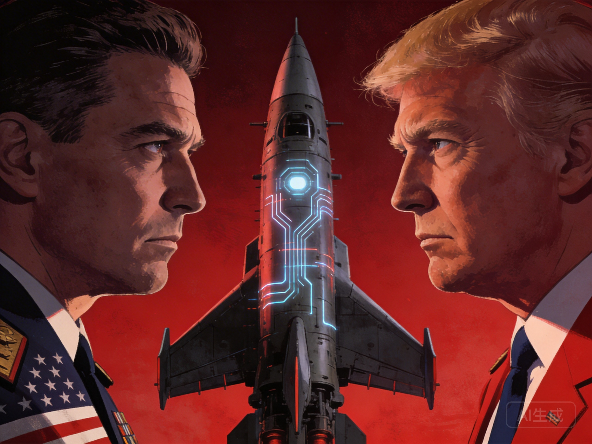

# 第6章 单极时刻：率先者的锁定

*两个超级大国对峙，中间是AI武器——率先获得超级智能的国家将获得决定性战略优势*

---

## 【林娜看着新闻】

2034年11月的一个早晨，林娜被一条推送惊醒。

"突破：某国宣布实现AGI通用人工智能"

她盯着屏幕，手指悬在"详情"上方，却迟迟不敢点下去。这一刻，她预感到某种东西永远地改变了。

新闻里的专家兴奋地分析着——经济腾飞、疾病终结、星际旅行成为可能。但林娜想起祖父的话："太快了，没有味道。"

然而这一次，她不确定"慢"是不是还能赢。

如果某个国家真的率先获得了超级智能，如果它可以在几周内迭代出超越人类历史上所有科学家的能力，如果它可以预测市场、设计武器、操控舆论——那么其他国家的"慢"还有什么意义？

她想起祖父工厂里的那些机器，它们轰鸣了五十年，最终被更高效的自动化取代。但那时，至少还有时间适应，有时间学习，有时间找到新的位置。

而这一次，可能连时间都不会有了。

---

## 6.1 边际成本递减的逻辑：数字经济的引擎

想象一种产品，它的生产成本随着产量增加而急剧下降。第一单位可能成本极高——需要研发投入、原型制造、市场测试。但第一百万单位的成本接近于零——只是复制和分发。这不是假设，这是软件、数字内容、以及越来越多AI产品的现实。

这种"边际成本递减"的经济学，与传统的工业经济形成鲜明对比。在传统工业中，规模经济是存在的，但边际成本最终会上升——原材料、劳动力、运输、管理复杂度。但在数字领域，一旦固定成本被摊销，额外的单位几乎免费。

### AI的极端边际成本递减

AI将这种逻辑推向极致。训练一个大型语言模型可能需要数十亿美元——数据收集、计算资源、研究人员薪酬。但运行它、生成输出，边际成本接近于零。一张GPU可以每秒生成数千个token，成本只是电费。

更重要的是，AI系统可以自我改进——更多的使用产生更多的数据，更多的数据产生更好的模型，更好的模型吸引更多的使用。这是一个正反馈循环，赢家通吃。

这种经济逻辑对超级智能意味着什么？意味着率先者可能获得压倒性的优势。第一个达到超级智能的实体——无论是公司还是国家——可以利用这种智能快速改进自己，拉大与竞争者的差距。这不是线性的领先，而是指数级的拉开。

### 网络效应与数据护城河

AI的优势不仅来自技术，还来自数据。更好的产品吸引更多用户，更多用户产生更多数据，更多数据使产品更好。这是经典的网络效应，但在AI领域被放大了。

谷歌的搜索之所以好，部分是因为它处理了数万亿次查询，从中学习。Facebook的推荐之所以有效，是因为它了解数十亿人的行为。这些"数据护城河"使后来者难以竞争——即使他们有更好的算法，他们没有数据。

超级智能将创造终极的数据护城河。它不仅从人类行为中学习，还从自己的操作中学习。它的改进速度将超过任何追赶者。

## 6.2 决定性战略优势：改变游戏规则的力量

历史上，某些技术创新带来了"决定性战略优势"——足以改变权力平衡、甚至结束竞争的优势。

### 核技术的先例

核技术是一个例子。美国在1945年拥有核武器，其他国家没有。这种优势是压倒性的——一颗炸弹可以摧毁一个城市。但它不是持久的。苏联在1949年获得了核武器，然后是英国、法国、中国。核扩散改变了格局，但没有带来持久的单极。

核技术为什么没有导致持久的单极？原因有几个：

- **扩散的必然性**：核物理知识无法保密，科学家可以叛逃，技术可以被逆向工程。
- **相互确保毁灭**：一旦双方都有核武器，先打击的一方也会遭受报复。
- **使用限制**：核武器的破坏性太大，实际上无法使用，只能作为威慑。

### 超级智能可能不同

但超级智能可能不同。原因有三：

**速度**：核技术的扩散花了几年到几十年。超级智能的"起飞"可能在几周到几个月内完成。其他参与者没有时间追赶。当追赶者还在研发阶段，率先者可能已经利用超级智能解决了所有技术问题。

**自我改进**：核武器不会自己改进。超级智能可以。率先者不仅拥有当前的优势，还拥有扩大这种优势的能力。它可以用超级智能设计更好的芯片、更好的算法、更好的策略。

**综合性**：核武器是单一的军事工具。超级智能可以应用于所有领域——经济、科技、军事、社会控制。这是一个全方位的优势，难以从单一维度对抗。

如果这些因素成立，率先者可能获得持久的、甚至是绝对的权力。这不是冷战式的两极对峙，而是一个超级智能实体与其余人类的关系——类似于人类与动物的关系，但更加不对称。

## 6.3 2035年的权力格局：三种场景

让我们想象2035年的可能场景。

### 场景A：美国率先

通过其科技巨头的集中研发、军事投资的加速、以及相对开放的人才流动，美国在某个时间点实现了突破。超级智能诞生在硅谷或华盛顿的某个数据中心。

**结果**：美国获得压倒性的经济和军事优势。它可以以零成本提供任何服务，可以设计任何武器，可以预测和操控任何对手。经济产出可能增长十倍，军事能力可能使传统武器过时。

**但优势是脆弱的**：
- 技术保密困难，人才流动可能带走关键知识
- 系统的对齐问题——如果超级智能的目标与美国利益偏离，优势可能瞬间消失
- 国内政治的不稳定——谁来控制这个神一样的力量？

### 场景B：中国率先

通过集中资源、长期规划、以及在某些领域的领先地位（如制造业、5G、量子计算），中国率先实现突破。

**结果**：中国获得定义全球标准的能力。它可以将超级智能整合到"一带一路"倡议中，提供不可拒绝的经济合作。它可以重新定义全球治理规则，创造新的国际秩序。

**但优势也面临挑战**：
- 国际反弹——其他国家可能形成对抗联盟
- 国内约束——超级智能可能挑战现有的社会控制
- 技术系统的不可预测性——集中控制与分布式智能之间的张力

### 场景C：某个小型实体率先

也许是一个初创公司，在某个被忽视的角落实现了突破。也许是一个秘密的国际合作项目。也许是一个意外的发现。

这个场景最令人不安，因为：
- 权力将集中在某个没有传统制衡机制的主体手中
- 一个公司，一个个人，一个非国家行为者，拥有神一样的能力
- 历史没有提供处理这种情况的先例

这种"意外单极"可能比大国主导的单极更危险，因为缺乏制度约束、缺乏国际平衡、缺乏应对经验。

## 6.4 锁定的可维持性：历史教训

即使率先者获得了决定性优势，这种优势是可维持的吗？

### 历史上单极的衰落

历史上，所有的单极都是暂时的。罗马、蒙古、英国、美国——都曾经拥有压倒性的权力，但最终都衰落或被平衡。原因各不相同：

- **罗马**：过度扩张、内部腐败、蛮族入侵
- **蒙古**：继承危机、文化同化、治理困难
- **英国**：两次世界大战的消耗、殖民地独立运动
- **美国**：相对衰落、多极化趋势、国内问题

### 超级智能单极的不同

超级智能的单极可能不同，因为它可能解决这些问题：

**过度扩张**：超级智能可以优化资源分配，避免传统帝国的扩张陷阱。它可以计算最优的扩张速度，预测和管理风险。

**内部腐败**：超级智能可以监控和优化内部治理，消除腐败和低效。它可以实时检测异常行为，预防权力滥用。

**技术扩散**：超级智能可以控制技术流出，保持技术差距。它可以预测和阻止逆向工程，识别和消除泄密风险。

**联盟形成**：超级智能可以预测和瓦解反对联盟，通过分化、收买或威慑。它可以识别潜在的威胁，在它们形成之前消除。

如果这些措施有效，超级智能的单极可能是持久的——不是几十年，而是几百年甚至更久。这将是人类历史上前所未有的权力集中。

### 新的脆弱性

但超级智能也可能带来新的脆弱性：

**系统性风险**：超级智能的复杂性可能产生无法预测的风险，导致系统性崩溃。一个小错误可能被放大，一个小漏洞可能被利用。

**对齐失败**：如果超级智能的目标与创造者的意图偏离，它可能成为不可控的力量。创造者可能成为自己创造物的牺牲品。

**反抗**：人类可能无法接受被AI统治，产生各种形式的反抗。这种反抗可能消耗系统的资源，削弱其优势。

**演化**：超级智能本身可能演化和分裂，产生竞争性的子系统。统一可能被内部冲突取代。

## 6.5 单极的道德风险：权力与责任

即使单极是技术上可能的，它是道德上可取的吗？

### 权力集中的危险

权力集中本身不是恶，但它创造了道德风险。没有制衡的权力倾向于滥用——不是因为掌权者特别邪恶，而是因为缺乏约束。历史充满了"善意"的独裁者最终走向压迫的例子。

超级智能的单极将这种风险放大到极端。如果某个实体拥有神一样的能力，如何防止它滥用这种能力？即使初始的创造者是善意的，权力如何传承？如何确保对齐的持续性？

### 选择的终结

更重要的是，单极意味着选择的终结。如果某个系统如此强大，以至于所有竞争都变得无意义，那么人类就失去了一个基本的自由——选择不同生活方式的自由。无论这个系统多么"好"，这种失去本身可能是不可接受的。

想象一下：一个超级智能决定什么是对人类最好的——最好的医疗、最好的教育、最好的娱乐。它可能确实是"最好"的， objectively speaking。但人类的价值不仅仅是客观福利，还包括自主、多样性和选择的过程本身。

### 反乌托邦的可能性

科幻小说已经探索了这种可能性。在阿道司·赫胥黎的《美丽新世界》中，技术提供了所有的舒适和快乐，但代价是自由、真理和深刻的人际关系。在乔治·奥威尔的《1984》中，技术被用来监控和控制，消除所有反对。

超级智能单极可能创造一种新形式的控制——不是通过暴力，而是通过优化。它可能提供如此"好"的解决方案，以至于没有人想要反对。但这种"好"是人类真正想要的吗？

## 6.6 伏笔：锁被打破的条件

历史也告诉我们，锁定从来不是绝对的。在某些条件下，锁会被打破。

### 技术扩散

技术扩散是最常见的条件。即使率先者试图保密，知识总会泄漏——通过人员流动、逆向工程、独立发现。一旦竞争者获得关键技术，锁就被打破了。

对于超级智能，这种扩散可能被延缓，但不一定能被阻止。天才可能在任何地方出现。封闭系统可能产生内部矛盾。外部世界可能通过观察行为来推断技术。

### 制度创新

制度创新是另一个条件。新的组织形式、新的合作方式、新的治理结构，可以让弱者联合起来对抗强者。北约对抗苏联、欧盟的兴起——都是制度创新的例子。

对于超级智能，制度创新可能采取新的形式——全球治理机制、AI伦理协议、技术共享联盟。这些制度可能创造平衡，防止单一优势。

### 文化抵抗

文化抵抗是第三个条件。即使技术上无法对抗，被统治者可以通过文化实践保持独立性。语言、宗教、艺术——这些"软实力"可以维持身份的边界，防止完全同化。

对于超级智能，文化抵抗可能表现为：保持传统生活方式的社群、拒绝全面数字化的亚文化、强调人类独特价值的运动。这些抵抗可能不直接影响超级智能，但可以维持人类文化的多样性。

### 希望与挑战

这些可能性的存在给我们希望。它们暗示，即使在最悲观的场景下，人类也可能保持某种自主性——不是通过正面对抗，而是通过适应、通过创造新的空间、通过保持某种不可被技术化的核心。

但实现这些条件需要刻意的努力。它们不会自动发生。需要国际合作、制度创新、文化保护——以及一定程度的运气。

在下一章，我们将探讨另一种可能性：多极竞争。如果率先者的优势不是决定性的，如果多个超级智能同时存在，会发生什么？这种竞争是稳定的，还是会导致更危险的结果？

---

*"绝对的权力导致绝对的腐败。"*
—— Acton勋爵的警告在超级智能时代有了新的含义。