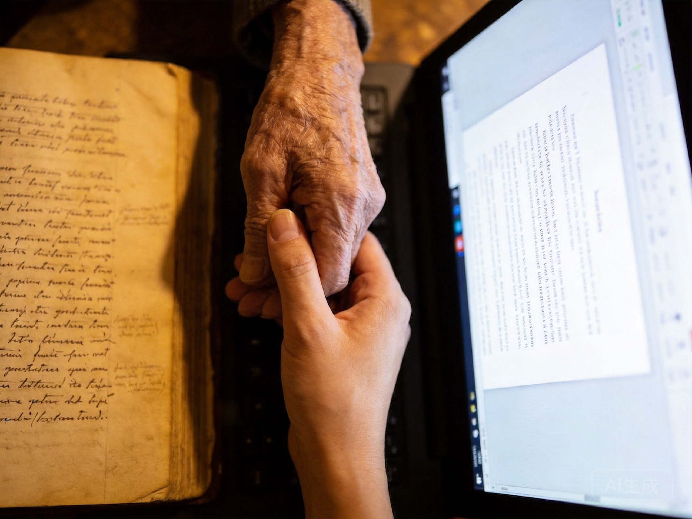

# 第三间奏：传承

*老人的手与年轻人的手交接，古老书籍与数字屏幕并存——传统知识传承面临AI时代的挑战*

---

## 我走过的桥，为什么比你走过的路还没用？

---

父亲教不了儿子，因为世界变化太快

当经验半衰期比青春期还短，我们靠什么认出自家人？

这是代际之间最沉默的哀伤。

---

## 林薇教祖父使用AI

让我们回到林薇和祖父林铁生。这次，角色反转——林薇试图教祖父使用公司新开发的"智能生活助手"。

"爷爷，这个应用可以帮你管理药物、预约医生、甚至监测你的情绪状态。你只需要这样说：'诺瓦，帮我预约下周的体检。'"

林铁生看着屏幕，那个充满图标和通知的界面。他试着说："诺瓦，帮我...帮我什么来着？"

"预约体检，爷爷。"

"诺瓦，帮我预约体检。"

"抱歉，我没有理解您的请求。请尝试说：'预约医生'或'查看健康档案'。"

林铁生看向林薇，那种眼神让林薇感到一阵刺痛。不是愤怒，不是沮丧，而是一种更深的东西——某种被时代抛弃的接受。

"没关系，爷爷，我们慢慢来。"

但林铁生摇摇头。"不是慢不慢的问题，"他说，"是我不知道为什么要学这个。我有日历，我有电话，我有你。为什么我需要这个...这个'诺瓦'？"

林薇试图解释效率、便利、安全——那些她在董事会里使用的词汇。但看着祖父的眼睛，她突然意识到这些词汇多么空洞。

"你知道吗，"林铁生说，"我年轻时，师傅教我操作机床。他花了三个月时间，每天一点点地教我。不是因为我学得慢，而是因为有些东西不能快——手感、直觉、对机器的'感觉'。那种传承，是...是身体对身体的，不是数据对数据的。"

"但现在不同了，爷爷。AI可以瞬间学会一切。"

"那它学会了什么？"林铁生问，"它学会了我的手感吗？它学会了我在机器出现异常声音时的直觉吗？"

林薇沉默了。

"更重要的是，"林铁生继续说，"你师傅教你的时候，你们之间建立了什么？信任？尊重？一种...一种连接？AI可以传递知识，但它能传递这种连接吗？"

---

## 【东西方：两种传承观】

### 西方的传承：知识与进步

在西方传统中，传承主要是**知识的传递**。每一代人站在前一代人的肩膀上，看得更远。

**启蒙运动的遗产**：
- 理性可以克服传统
- 进步意味着超越过去
- 年轻人应该质疑权威

**现代教育的模式**：
- 知识被系统化、标准化
-  credential（证书）证明能力
- 终身学习适应变化

这种模式的优势是灵活、创新、适应快。但代价是什么？

### 东方的传承：关系与延续

东方传统提供了不同的视角。在儒家思想中，传承不仅是知识，更是**关系的延续**、**德性的培养**、**文化的传递**。

**师徒关系**：
- 不仅是技能传递，更是人格塑造
- "传道、授业、解惑"——传道先于授业
- 身体力行的示范，而非口头讲授

**家族传承**：
- 祖先崇拜——过去的存在仍然影响现在
- 家训、家风——无形的规范代代相传
- 不是选择继承传统，而是传统定义你是谁

**技艺传承**：
- "功夫"不仅是技术，更是修养
- 需要时间沉淀，不能速成
- 师傅选择徒弟，不仅是能力，更是品格

---

## 传承断裂的时代

21世纪30年代，这两种传承模式都面临危机。

**知识传承的失效**：
- AI可以瞬间学习任何知识
- 人类教师的权威被削弱
- "师傅"变成了"信息提供者"

**关系传承的困难**：
- 地理流动性增加，多代同堂减少
- 时间压力让"陪伴"变成奢侈品
- 虚拟连接替代面对面互动

**经验贬值**：
- 长者不再"更聪明"——他们的经验可能过时
- 年轻人不再"尊重"——他们可以用AI获得更好的建议
- 代际之间的共同语言消失

### 林薇的困境

林薇体会到了这种断裂。她无法向祖父解释她的工作——不是因为他不能理解技术，而是因为他的经验框架完全不适用。

祖父的经验是：**通过 struggle 获得技能，通过技能获得尊重，通过尊重获得地位**。

林薇的现实是：**AI可以完成 struggle，技能快速贬值，地位来自与AI协作的能力**。

他们说着不同的语言，生活在不同的世界。

但最让林薇痛苦的是，她不知道如何将祖父的智慧——那种关于耐心、关于坚持、关于在困难中寻找意义的智慧——传递给下一代。因为她自己也在质疑：这些智慧在新的世界里还有价值吗？

---

## 【此刻，请你选择】

假设你是一位长者，你有两个选择：

**选择A**：接受"认知增强"，让你的大脑保持与年轻人同步的学习能力，但代价是你会逐渐失去对过去的记忆——那些定义你是谁的经历。

**选择B**：保持自然衰老，接受自己的经验会过时，但保留完整的记忆和身份认同。

你会选择哪一个？

这不是假设。类似的技术正在研发中。

---

## 什么可以传承？

面对传承的断裂，什么仍然可以传递？

也许不是具体的知识——知识变化太快。

也许不是特定的技能——技能被AI替代。

但也许，某些更深层的东西可以传承：

**知疼着痒的能力**——那种理解他人、关心他人、与他人共情的能力。这个中文成语字面意思是"知道疼痛和瘙痒"，引申为深切理解和关怀。这种能力不依赖于特定的技术环境，在任何时代、任何社会都是有价值的。

**在不确定性中决策的能力**——当没有明确的规则可循时，如何权衡不同的价值，如何承担风险，如何从错误中学习。

**建立和维护关系的能力**——不是社交媒体上的"连接"，而是深度的、持续的、相互承诺的关系。

这些"元能力"可能是真正的传承——它们需要通过关系学习，需要时间沉淀，不能被算法加速。

**林薇的领悟**：

那天晚上，林薇没有继续教祖父使用那个应用。相反，她坐下来，让祖父教她——教他如何用手工磨咖啡，如何识别花园里的植物，如何修理一把旧椅子。

"这些有什么用呢？"她问。

祖父笑了。"也许没用，"他说，"但在这个过程中，我们在传承某种东西。不是知识，而是...一种存在的方式。一种不着急、不放弃、在做的过程中找到意义的方式。"

林薇明白了。传承不是关于过去，而是关于未来——不是关于保留旧的东西，而是关于创造新的连接，让过去的智慧以新的形式照亮未来的道路。

现在，让我们回到主线，追问权力的问题——当超级智能出现，谁控制它？谁从中获益？