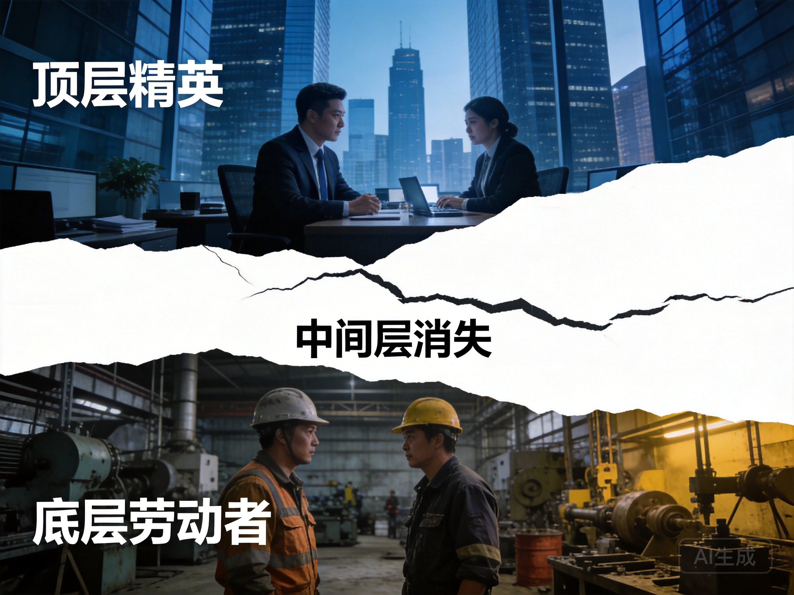

# 第8章 中间层的蒸发：技能与财富

*技能极化——中间层消失，只剩顶层精英和底层劳动者。AI时代的社会分层正在加速*

---

## 8.1 技能极化的经济学：中间层的消失

经济学家长期以来观察到劳动力市场的"极化"现象：高技能工作（如管理、专业、技术）和低技能工作（如服务、照护、手工）的需求增加，而中间层工作（如文员、制造业、常规认知工作）的需求减少。

### 技术变革的历史模式

这不是新现象。技术变革一直在重塑劳动力市场：

**工业革命**（18-19世纪）：机械化取代了农业和手工业的工作，创造了工厂工作。结果是城市化、工人阶级的形成、以及后来工会和劳工运动的兴起。

**电气化**（19-20世纪）：电力普及提高了生产力，创造了新的产业（如家用电器、电信）。白领工作增加，中产阶级扩大。

**信息技术革命**（20世纪末）：计算机自动化了许多常规任务，从制造业到办公室工作。结果是"技能偏向的技术变革"——高技能工人受益，低技能工人受损。

AI将这种极化推向极端。原因在于AI的能力分布：它擅长那些可以被形式化、有明确规则、需要处理大量信息的工作——这些正是中间层工作的特征。但它还不擅长那些需要身体灵活性、人际互动、创造性判断的工作——这些是高技能和低技能工作的特征。

### 具体的职业影响

考虑一些例子：

**法律行业**：
- AI可以快速检索案例、起草合同、预测判决
- 这取代了初级律师的工作（法律研究、文件起草）
- 但增强了高级律师的能力——他们可以专注于策略、谈判、客户关系
- 结果是"超级明星"效应：最好的律师服务更多客户，获得更多收入；普通律师发现工作被挤压

**医疗行业**：
- AI可以诊断影像、分析化验、推荐治疗方案
- 这改变了放射科医生、病理学家的角色
- 但增强了专家的能力——他们可以专注于复杂病例和患者关系
- 结果是：常规诊断被AI处理，人类医生专注于需要判断和同理心的任务

**金融行业**：
- AI可以分析市场、执行交易、评估风险
- 这取代了交易员和分析师
- 但增强了基金经理的能力——他们可以专注于宏观判断和关系管理
- 结果是：量化交易主导市场，人类专注于非量化因素

### 超级明星经济的强化

结果是"超级明星经济"的强化。最好的律师、医生、基金经理，借助AI，可以服务更多的客户，获得更大的回报。而那些技能平庸的人——曾经构成社会中产阶级的主体——发现自己被挤压。

这种强化有自我放大的特性：
1. 最好的专业人士获得更多资源（客户、数据、计算能力）
2. 更多资源使他们能够使用更好的AI工具
3. 更好的工具提高他们的生产力
4. 更高的生产力吸引更多资源
5. 循环继续，差距扩大

## 8.2 资本-技能互补性断裂：从合作到替代

传统经济学有一个概念叫"资本-技能互补性"：资本（技术、设备）与技能相辅相成，技能越高，从资本中获益越多。这就是为什么教育水平的提高通常伴随着工资的增长——教育让你能够使用更先进的技术。

### 传统互补性

在传统经济中，技术进步通常增强了高技能工人的生产力：
- 计算机提高了知识工作者的效率
- 精密工具提高了熟练工匠的能力
- 复杂软件增强了分析师的判断

这创造了"技能溢价"——高技能工人获得更高工资，因为他们与技术的结合更有生产力。

### AI的替代效应

但AI可能打破这种互补性。当AI本身成为"技能"的替代品，而不是补充品时，拥有资本（AI系统）的人不需要高技能工人。他们可以雇佣低技能工人监督AI，或者用AI完全自动化。

这创造了一个新的分配逻辑：回报流向资本所有者，而不是技能拥有者。这不是因为剥削，而是因为技术的替代效应。AI让资本比以前更"自给自足"——它不需要人类技能来增值。

### 具体例子

**翻译行业**：
- 过去：双语专家使用计算机辅助翻译工具，提高效率
- 现在：AI翻译（如DeepL、Google Translate）质量接近人类，只需要少量人工校对
- 结果：翻译专家的溢价下降，资本（AI系统）捕获价值

**编程行业**：
- 过去：程序员使用IDE、编译器提高生产力
- 现在：AI编程助手（如Copilot）可以生成大量代码，只需要人类审查
- 结果：初级程序员需求下降，"提示工程"等新技能出现，但价值流向平台所有者

**分析行业**：
- 过去：数据分析师使用统计软件分析数据
- 现在：AI可以自动生成洞察，只需要人类确认
- 结果：分析工作标准化，高价值转向战略判断和关系维护

### 仍然有价值的技能

当然，这种效应不是均匀的。某些技能——那些AI难以替代的——仍然有价值，甚至可能升值：

- **创造性技能**：提出新问题、发现新模式、创造新价值
- **社交技能**：建立信任、协调利益、激励他人、解决冲突
- **身体技能**：精细操作、空间导航、环境适应、非结构化环境中的行动
- **元认知技能**：学习如何学习、在不确定性中决策、反思自己的思维、适应新情境

但这些技能的分布是不均的。不是每个人都有同等的创造性能力或社交天赋。教育和培训可以帮助，但只能在一定程度上——这些技能有先天的成分，也有早期发展的关键期。

## 8.3 工作伦理的崩溃：当劳动失去意义

工作不仅是收入来源，也是意义来源。在现代社会，"你是谁"很大程度上由"你做什么"定义。工作提供了结构、目的、社会认同、自我价值感。

### 工作的多重功能

**经济功能**：获得收入，维持生计
**社会功能**：社会交往，建立关系网络
**心理功能**：自我效能感，成就感，身份认同
**时间结构**：组织日常生活，提供节奏和规律

当工作被自动化或变得没有意义，所有这些功能都受到影响。

### 工作伦理的历史

"工作伦理"——认为工作本身就是美德的信念——不是普遍的，而是特定历史条件的产物。

**前现代**：工作在等级社会中被视为地位的标志。贵族不工作，奴隶和农民工作。工作本身不是价值的来源。

**清教伦理**（16-17世纪）：加尔文主义将工作视为荣耀上帝的方式。勤奋、节俭、自律成为美德。这种伦理为资本主义提供了道德基础。

**工业时代**：工作成为公民身份的基础。工会运动争取"工作的权利"。福利国家建立在"就业社会"的基础上——每个人都有工作的义务和权利。

**后工业时代**：服务业取代制造业，知识工作取代体力劳动。工作变得更加抽象，但也更加不稳定。

### 后工作社会的挑战

如果AI自动化大部分工作，我们面临一个根本问题：没有工作，人如何定义自己？

一种可能是"工作伦理的崩溃"——那种认为工作本身就是美德的信念的瓦解。这在历史上发生过。贵族社会不工作，古代希腊的公民不工作（奴隶工作），未来的社会可能再次将工作视为可选择的活动，而不是必须的义务。

但这种转变是痛苦的。工作伦理的崩溃不是自动的——它伴随着焦虑、抑郁、社会混乱。那些失去工作的人，如果找不到新的意义来源，可能陷入存在危机。

想想林薇的午餐对话。老教授担心"如果所有的决策都被优化了，如果所有的摩擦都被消除了，如果'更好'的实现不再需要 struggle……那么，人还剩下什么？"这个问题指向工作伦理的核心：struggle——与材料的斗争、与他人的协商、与自己的局限的对抗——是意义的重要来源。

如果AI消除了struggle，它可能也消除了意义的来源。这不是说我们应该拒绝AI——许多struggle是不必要的痛苦，消除它们是进步。但我们需要思考：什么样的struggle应该保留？什么样的摩擦是有价值的？

## 8.4 新的社会契约：应对极化的选项

面对技能极化和财富集中，社会需要某种回应。历史提供了几种模式：

### 福利国家模式

通过税收和转移支付，重新分配财富，确保基本生活水平。

**优点**：
- 缓解贫困，减少不平等
- 提供安全网，降低社会动荡
- 政治可行性较高

**缺点**：
- 不解决意义问题——人们有收入，但没有目的
- 可能面临财政和政治的极限
- 依赖就业税收，如果就业减少，财政基础削弱

### 全民基本收入（UBI）

无条件地给每个人基本收入，让他们可以选择工作或不工作。

**优点**：
- 简单，行政成本低
- 不羞辱，不要求证明自己"值得"帮助
- 承认自动化的现实，不假装每个人都能找到工作

**缺点**：
- 如何融资？可能意味着高税收或削减其他福利
- 是否会产生依赖？人们是否会失去工作动力？
- 是否足以提供意义？钱可以购买商品，但不能购买目的

### 工作分享

减少每个人的工作时间，让更多人参与工作。

**优点**：
- 保持工作的社会功能
- 减少失业
- 可能提高生活质量（更多闲暇时间）

**缺点**：
- 可能降低效率
- 需要文化的转变——从"工作越多越好"到"适度工作"
- 雇主可能抵制——培训更多员工的成本

### 新职业创造

投资那些AI难以替代的领域——照护、教育、艺术、社区建设。

**优点**：
- 创造了新的就业机会
- 回应社会需求（老龄化社会需要更多照护）
- 这些工作提供意义和满足感

**缺点**：
- 这些领域的经济价值如何衡量？
- 如何获得足够的投资？市场可能低估这些工作的价值
- 需要改变社会对这些工作的评价

### 所有权改革

改变谁拥有AI系统的所有权。如果AI成为主要生产工具，广泛分布的所有权可能缓解不平等。

**选项**：
- **公有制**：国家拥有关键AI基础设施
- **员工持股**：工人拥有他们使用的AI系统
- **合作社**：社区拥有和管理AI
- **数据合作社**：人们集体拥有和管理自己的数据

**挑战**：
- 如何在不扼杀创新的情况下实现？
- 如何在全球范围内协调？
- 既得利益者会强烈抵抗

这些选项不是互斥的，它们可以组合。但每种都有其挑战和权衡。选择哪种路径，或者哪种组合，取决于政治、文化、以及我们对"好社会"的愿景。

## 8.5 身体的在场：劳动的重新定义

让我们回到第一间奏的问题：身体。

在AI时代，身体可能成为区分人类劳动和机器劳动的关键。不是身体的力量（机器更强），而是身体的在场——那种不可替代的、具体的、会死亡的栖居。

### 照护工作的重要性

考虑照护工作。理论上，机器人可以提供更好的照护——它们不需要休息，不会情绪化，可以持续监测。但人们通常更喜欢人类照护——不是因为它更有效，而是因为它是人类。

人类的在场、触摸、眼神接触，有某种机器无法复制的东西。这种"在场的身体"提供：
- **情感连接**：共情、理解、陪伴
- **判断**：在复杂情境中做出细微的判断
- **灵活性**：适应意外情况
- **意义**：被照护者感到被重视，作为人而不是病例

类似地，教育、心理治疗、艺术创作——这些活动的技术层面可能被AI增强或替代，但它们的人类维度——关系、共鸣、共同的脆弱性——可能变得更加珍贵。

### 从生产性到关系性

这暗示了一种可能的未来：人类劳动从"生产性"转向"关系性"。不是生产商品和服务，而是建立和维护关系。不是最大化输出，而是提供在场。不是效率，而是意义。

这种转变有深刻的含义：
- **挑战经济的基本逻辑**：效率、增长、生产力不再是唯一标准
- **提出新的价值标准**：质量、深度、真实性、关系质量
- **要求新的制度**：如何组织关系性工作？如何衡量其价值？如何分配其收益？

### 身体作为边界

身体也可能成为抵抗算法优化的边界。算法可以优化数据、优化流程、优化资源分配，但身体有它自己的节奏——需要睡眠、需要休息、需要社交接触、需要时间"无所事事"。

保护身体的时间——保护它不被完全优化——可能是保护人性的最后防线。

## 8.6 游手好闲的身体vs自由舒展的身体

如果工作不再是必须的，身体会变成什么？

### 游手好闲的身体

一种可能是"游手好闲的身体"——缺乏目的、沉溺于消费、被娱乐麻醉。

这不是一个悲观的预测，而是基于对人性弱点的认识。当外部约束消失，许多人可能难以自我管理，陷入某种存在的空虚。历史上有例子——罗马帝国的颓废、贵族阶级的无聊、福利依赖者的沮丧。

这种"游手好闲"可能导致：
- 心理健康危机（抑郁、焦虑、成瘾）
- 社会凝聚力的下降（人们孤立，缺乏共同目标）
- 政治秩序的脆弱（人们容易被极端思想吸引）

### 自由舒展的身体

另一种可能是"自由舒展的身体"——从生存压力下解放，追求自我实现、创造、探索、关系。

这是乌托邦的愿景，但它也有现实的基础：
- 人类有创造的冲动（艺术、科学、技术）
- 人类有学习的欲望（好奇心、掌握技能）
- 人类有连接的需要（友谊、社区、爱）

如果这些需求被满足，人可能达到更高的存在状态——不是被工作定义，而是被自己的选择和创造定义。

### 决定因素

哪种未来实现，不取决于技术，而取决于制度和文化。技术创造了可能性，但社会选择实现哪种可能性。

如果选择游手好闲，我们需要考虑后果：公共健康的危机、社会凝聚力的下降、政治秩序的脆弱。

如果选择自由舒展，我们需要创造条件：
- **教育**：不仅教技能，也教如何寻找意义
- **文化机构**：博物馆、图书馆、社区中心，提供参与机会
- **公共空间**：公园、广场、咖啡馆，促进社会互动
- **心理健康支持**：帮助人们应对自由的挑战

这不是非此即彼的选择。现实中，两种倾向都会存在，在不同人群中以不同比例。但社会的整体方向——我们鼓励什么、奖励什么、认可什么——将决定哪种倾向占主导。

在下一章，我们将探讨另一个维度：代际。当知识快速折旧，当技能不断更新，当经验不再自动带来权威，代际关系如何变化？传承——我们在第三间奏中探讨的主题——如何在实践中实现？

---

*"劳动创造了人"——但如果劳动不再需要，人会成为什么？*