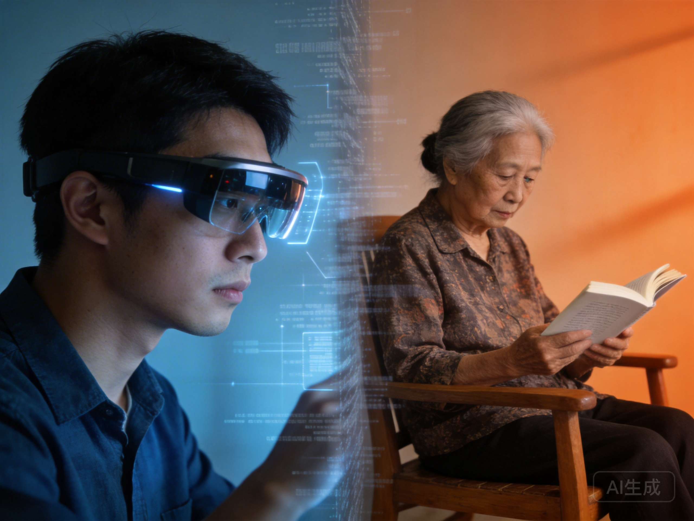

# 第9章 代际的断层：传承与流动

*代际断层——年轻人用AR眼镜，老人看纸质书。数字鸿沟正在造成情感疏离*

---

## 9.1 知识半衰期的压缩：当学习速度赶不上遗忘速度

在20世纪，一个工程师在大学学到的知识可以使用20-30年。在21世纪，这个时间缩短到5-10年。在2035年，可能只有2-3年。

这不是说基础知识变得不重要——数学、物理、逻辑——而是说应用层面的知识在快速贬值。今天的最佳实践，明天就可能过时。昨天还需要的技能，今天就被AI替代。

### 知识加速的历史

知识增长一直在加速，但AI时代将这种加速推向极端：

**古代**：知识增长缓慢，一代人学到的知识可以传给下一代，几乎没有变化。
**印刷时代**：知识开始系统传播，但更新仍然缓慢。
**互联网时代**：知识爆炸，但人类学习速度仍是瓶颈。
**AI时代**：AI系统可以瞬间学习新技能，人类学习相对变得极其缓慢。

### 终身学习的悖论

这种加速对学习有深刻影响。传统教育模式假设：先学习，然后工作，然后退休。学习阶段集中在前半生，工作阶段是应用所学。

但现在，学习必须持续终身——不是作为一种选择，而是作为一种必须。

终身学习听起来理想，但它有实际的挑战：

**经济成本**：谁为持续学习付费？如果一个人已经负债（学生贷款、房贷），如何负担进一步的教育？

**机会成本**：学习需要时间，这意味着减少工作或休闲。对于已经有家庭责任的中年人，这尤其困难。

**认知成本**：学习的能力本身可能有年龄相关性。虽然"大脑可塑性"持续终身，但它在成年早期后确实下降。学习新的编程语言、新的概念框架、新的工作方式，对年轻人可能很容易，对中年人可能很困难。

**收益的不确定性**：学习的收益是不确定的，而成本是确定的。许多人可能选择不学习，陷入技能的快速贬值。

### 教育的转型

这要求教育系统的根本转型：

- 从"一次性"教育到"持续"教育
- 从"传授知识"到"培养学习能力"
- 从"标准化"到"个性化"
- 从"机构"到"嵌入式"（工作场所学习、微证书、在线模块）

但这些转型需要时间、投资、和制度创新。在转型期间，许多人可能掉队。

## 9.2 经验传递的失效：当长者不再智慧

在传统社会中，经验是宝贵的资产。长者知道如何在特定土壤中种植作物，如何在特定社区中解决冲突，如何在特定行业中取得成功。这些知识不是书本上的，而是嵌入在实践中的——通过观察、模仿、试错获得。

### 经验的价值

经验提供：
- **隐性知识**：无法言传的技能，只能通过实践获得
- **模式识别**：识别情境类型，应用适当的应对策略
- **关系网络**：多年建立的人际连接和信任
- **判断力**：在信息不完整时做出决策的能力

### 经验贬值的原因

当环境快速变化，这种经验知识的价值下降：

**技术过时**：种植作物的方法可能因为气候变化、新种子品种、新机械而失效。

**社会结构变化**：社区冲突的解决可能因为社会流动性增加、传统权威衰落、社交媒体而改变。

**行业颠覆**：行业的成功模式可能因为技术颠覆、全球化、新商业模式而完全改变。

**代际断裂**：长者试图教导年轻人，但年轻人面对的是不同的世界。年轻人忽视长者的建议，因为他们认为那是过时的。双方都感到沮丧——长者觉得不被尊重，年轻人觉得不被理解。

想想林薇的祖父。他的经验——工厂工作、工会组织、集体的斗争——对林薇的世界有多少相关性？林薇面临的挑战——远程工作、AI辅助决策、全球团队管理——对祖父来说可能是完全陌生的。

这种断裂不仅是个人的，也是结构的。教育系统无法跟上变化的速度。企业培训投资于员工，但员工可能在技能过时前离开。政府政策基于过去的经验，但过去的经验不再适用。

### 经验的重新定义

但这不意味着经验完全没有价值。某些类型的经验可能变得更加珍贵：

- **元经验**：学习如何学习，适应变化的经验
- **人际经验**：建立关系、解决冲突、领导团队的经验
- **判断经验**：在不确定性中决策，权衡不同价值观的经验
- **韧性经验**：经历失败，从中恢复的经验

这些"深层经验"不依赖于特定技术或行业，它们可能更有持久的价值。

## 9.3 认知增强技术的可及性：新的不平等来源

超级智能时代可能带来新的不平等来源：认知增强技术。

### 增强技术的类型

想象几种可能的技术：

**神经接口**：直接连接大脑和计算机，增强记忆、计算、学习能力。例如，Neuralink等公司正在开发的脑机接口。

**基因编辑**：优化与认知能力相关的基因，提高智商、创造力、情绪稳定性。CRISPR技术使这成为可能，虽然伦理争议巨大。

**药物增强**：提高注意力、记忆力、执行功能的药物。如莫达非尼、利他林等，虽然效果和风险仍有争议。

**AI辅助**：直接接入外部AI系统，获得超人的信息处理能力。如智能眼镜、耳内助手等。

### 认知不平等的风险

这些技术不是平等的。它们有成本——金钱成本、健康风险、社会接受度。最初，只有富人能够负担。然后是中产阶级。穷人可能被抛在后面，形成新的"认知阶级"分层。

这种分层可能比传统的经济分层更根本：

- **不可补偿**：财富可以重新分配（虽然困难），但认知能力的差异——如果是生物性的——很难消除。

- **自我强化**：认知能力强的人更可能获得高薪工作，积累更多资源，为下一代提供更好的增强，形成恶性循环。

- **种姓制度的风险**：一个认知增强的精英可能认为自己"天生"优越，形成新的种姓制度，基于生物能力而非社会地位。

### 反转的可能性

即使技术变得普及，使用方式可能不同。富人可能选择"自然"发展，拒绝增强，视其为"作弊"或"不自然"。穷人可能被迫使用增强，以在竞争中生存。

这种反转——富人"自然"，穷人"增强"——将颠覆我们对进步的理解。技术不再是解放的工具，而是维持不平等的工具。

### 伦理和政策挑战

认知增强引发深刻的伦理和政策问题：

- **是否应该允许？** 如果禁止，黑市会出现；如果允许，不平等加剧。
- **谁有权访问？** 医疗需要？教育机会？市场购买？
- **什么是"正常"？** 如果增强成为常态，"自然"是否变成残疾？
- **个人还是集体？** 个人选择权 vs 社会公平

这些问题没有简单的答案。但它们必须在技术成为现实之前被讨论，因为一旦技术可用，市场压力将推动其采用。

## 9.4 家庭功能的变迁：最后的堡垒？

家庭一直是最基本的传承单位。在家庭中，我们学习语言、习得文化、内化价值观。家庭提供了安全的基地，让我们可以探索世界，知道有一个地方可以回来。

但超级智能时代可能改变家庭的所有功能。

### 生育的变迁

AI和机器人可能接管大部分生育相关的任务：

- **孕前**：基因筛查、优化建议
- **孕期**：监测、营养指导、风险预测
- **分娩**：辅助或替代自然分娩
- **产后**：新生儿照护、健康监测

代孕技术、人工子宫、基因编辑——这些技术可能将生育从"自然过程"变成"设计选择"。

**后果**：
- 生育变成纯粹的个人选择，社会压力减轻
- 可能加剧生育率下降，因为不再有"传宗接代"的压力
- 可能创造新的不平等——谁能负担"设计婴儿"？

### 照护的外包

如我们在第8章讨论的，照护可能外包给AI和机器人：

- **儿童照护**：AI保姆、教育机器人
- **老年照护**：陪伴机器人、健康监测
- **病患照护**：远程医疗、康复机器人

这不意味着家庭照护消失，但它可能从"必须"变成"选择"——富人选择人类照护作为奢侈品，穷人依赖机器照护。

**后果**：
- 照护质量可能提高（机器不会疲劳、不会情绪化）
- 但情感连接可能减弱，代际纽带可能变弱
- 传统上由家庭提供的价值观传承可能中断

### 教育的转型

AI导师可能提供个性化的、高质量的、全年无休的教育：

- **个性化**：根据每个孩子的学习风格和节奏调整
- **高质量**：访问世界最好的教育资源
- **全年无休**：不受学校时间表限制

家庭的教育功能可能减弱，或者转变：
- 从"教知识"到"培养品格"
- 从"学业辅导"到"情感支持"
- 从"知识传递"到"价值观讨论"

**后果**：
- 教育更加公平（如果所有人都能访问）
- 或更加不平等（如果优质AI教育需要付费）
- 家庭与学校的关系可能重新定义

### 情感支持的替代

虚拟伴侣、社交机器人、沉浸式娱乐——这些可能满足情感需求，减少家庭的功能。

- **儿童**：AI朋友、虚拟宠物、沉浸式游戏
- **成人**：虚拟伴侣、社交机器人、情感支持AI
- **老人**：陪伴机器人、记忆辅助、虚拟家人

对于一些人，这可能是解放——从家庭的义务中解放。对于另一些人，这可能是剥夺——剥夺了深度连接的机会。

**后果**：
- 孤独可能减少（总有"某人"可用）
- 但真实人际关系可能变得更加困难
- 当人们可以从AI获得无条件的爱，真实人际关系的复杂性可能变得难以容忍

### 经济互助的弱化

基本收入、社会福利、AI管理的投资——这些可能减少家庭作为经济单位的重要性。

- 个人不再依赖家庭的经济支持
- 婚姻的经济动机减弱
- 多代同堂的经济理由消失

**后果**：
- 个人自由增加
- 但家庭凝聚力可能减弱
- 在危机时，人们可能缺乏传统的支持网络

### 家庭会消失吗？

这些变化不意味着家庭会消失。人类有深刻的连接需求，这种需求可能继续通过家庭来满足。但家庭的形式可能多样化：

- 核心家庭可能不再是唯一或主要形式
- 单身、同居、多代同堂、选择性的亲属关系可能更加普遍
- "家庭"的定义可能更加宽泛，包括朋友、社群、甚至AI伴侣

关键在于：家庭是否还能提供那种无法被技术替代的东西——无条件的爱、深度的理解、共同的历史、和那种"无论发生什么，我都在"的安全感？

## 9.5 传承的智慧：知疼着痒的能力

面对代际断裂，什么可以传承？

也许是"知疼着痒"的能力——那种理解他人、关心他人、与他人共情的能力。这个中文成语字面意思是"知道疼痛和瘙痒"，引申为深切理解和关怀。

### 知疼着痒的内涵

这种能力包括：
- **情感共情**：感受他人的感受
- **认知共情**：理解他人的观点和处境
- **关怀行动**：基于这种理解采取行动
- **关系维护**：在困难时期维持关系

### 为什么它重要

这种能力不依赖于特定的技术环境。它在任何时代、任何社会都是有价值的：

- 当技术知识快速贬值，人际关系的能力变得更加珍贵
- 当工作环境不断变化，能够与他人建立信任、协作、解决冲突的能力成为关键
- 当AI可以处理信息，人类的独特价值在于连接和理解

### 如何传承

知疼着痒不是通过书本学习的。它通过：
- **关系学习**：被关爱，然后学会关爱他人
- **榜样学习**：看到他人如何表现关心
- **实践学习**：在真实的情境中，面对真实的需求，做出回应

但这些学习需要特定条件：
- **时间的投入**——不能被算法加速
- **真实的关系**——不能被虚拟替代
- **榜样**——那些示范如何关心他人的人

这些条件在现代社会中是稀缺的。时间压力、地理流动、核心家庭的孤立——这些都减少了知疼着痒传承的机会。

超级智能可能加剧这个问题——如果我们依赖AI满足情感需求，我们可能就失去了学习知疼着痒的机会。

## 9.6 社会流动的新通道：当梯子被抽走

如果传统的教育和职业路径不再可靠，社会流动如何实现？

### 传统的流动通道

历史告诉我们，社会流动通常通过几个通道：

**教育**：通过学习获得证书，进入更高社会阶层
**婚姻**：通过婚姻提升社会地位
**创业**：通过商业成功积累财富
**政治参与**：通过政治活动获得权力和地位
**文化成就**：通过艺术、体育等获得认可

### AI时代的挑战

在AI时代，这些通道如何变化？

**教育**：
- 如果知识快速贬值，正规教育的回报下降
- 但"学会学习"的能力、元认知技能、适应性——这些可能变得更加重要
- 教育的目标可能从"传递知识"转向"培养能力"

**婚姻**：
- 在高度流动的社会，婚姻作为社会流动通道的功能可能减弱
- 人们更多基于个人吸引而非社会地位选择伴侣
- 但新的分层——认知增强 vs 未增强——可能创造新的"婚姻市场"

**创业**：
- AI可能降低创业的门槛——提供分析、自动化、市场准入
- 但也可能提高门槛——大公司的规模优势、数据的集中、网络效应
- 创业可能成为精英的游戏，普通人更难参与

**政治参与**：
- AI可能改变政治——从民粹主义的放大到新的参与形式
- 但政治作为社会流动通道的功能可能减弱——如果政治本身被AI辅助或替代

**文化成就**：
- 在AI可以生成高质量艺术、音乐、文学的时代，人类的文化成就还有什么价值？
- 也许是真实性、是故事背后的生活、是与创作者的个人连接
- 文化可能从"产品"转向"体验"，从"消费"转向"参与"

### 新的流动逻辑

这些通道的变化意味着：社会流动的逻辑可能需要重新定义：

- **不是从下层到上层的线性上升**，而是在不同领域、不同生活方式之间的横向移动
- **不是财富的积累**，而是意义的发现
- **不是地位的竞争**，而是关系的建立

这种新的流动逻辑可能更加多样、更加个人化，但也更加不确定。没有明确的"成功"标准，没有单一的"向上"路径。每个人必须找到自己的道路，定义自己的价值。

这既是解放，也是负担。传统社会流动的确定性消失了，取而代之的是一种存在的不确定性——"我是谁？我应该追求什么？"

在下一章，我们将探讨另一个维度：空间。超级智能如何改变城市、地理、中心与边缘的关系？远程在场技术承诺"距离的死亡"，但它真的消除了地理的重要性吗？

---

*"父亲教不了儿子，因为世界变化太快"——但也许，他可以教他如何学习，如何关心，如何在变化中找到意义。*