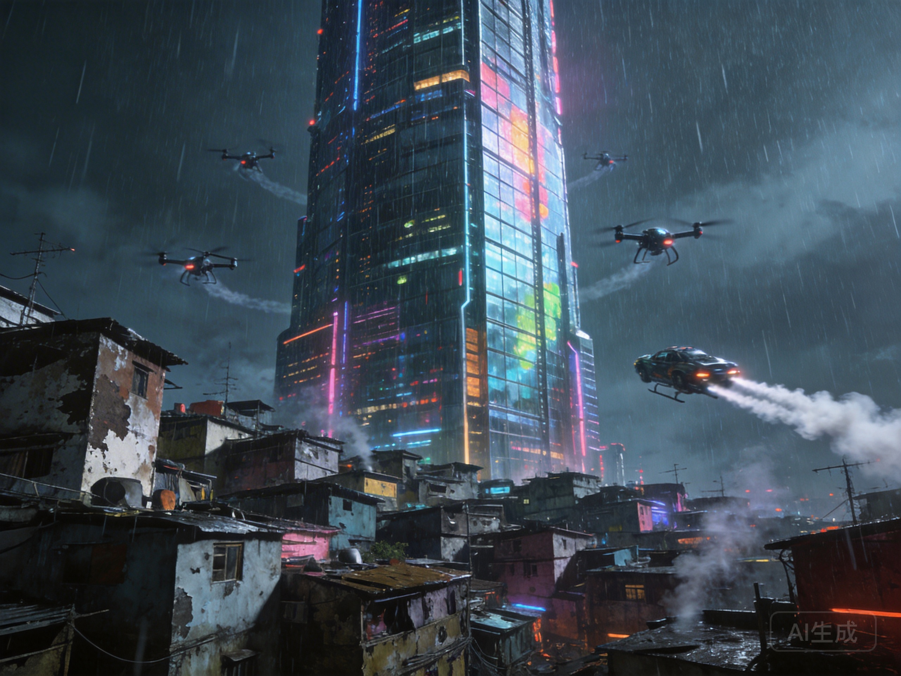

# 第10章 空间的重组：中心与边缘

*未来城市：中心与边缘的空间重构*

## 10.1 远程在场的悖论：距离的死亡与重生

远程在场技术——全息投影、虚拟现实、高保真通信——承诺消除距离的限制。你可以在上海的客厅里与北京、班加罗尔、旧金山的同事"面对面"交流。你可以"参观"博物馆、"参加"演唱会、"探索"城市，而不离开家。

这种技术似乎宣告了"距离的死亡"。地理不再重要，位置不再决定机会。世界变成平的，任何地方都可以连接到全球网络。这是托马斯·弗里德曼在《世界是平的》中描述的愿景的终极实现。

但实际情况更复杂。远程在场确实改变了某些活动的空间逻辑，但它也创造和强化了新的中心与边缘。

### 远程在场的承诺

**效率**：无需通勤，节省时间和能源
**灵活性**：在任何地方工作，选择生活环境
**可达性**：边缘地区可以访问全球资源
**可持续性**：减少交通，降低碳排放

### 新的不平等

**时间区的暴政**：虽然远程在场消除了空间距离，但它不能消除时间差异。当柏林是上午，北京是下午，旧金山是深夜。全球协调需要有人牺牲——通常是边缘地区适应中心地区的时间。

**带宽的不平等**：高质量的远程在场需要基础设施——光纤、5G、数据中心。这些集中在富裕地区。边缘地区可能只有低带宽连接，无法充分参与远程经济。结果是"数字鸿沟"的深化，不是简单的有和无，而是质的差异。

**物理交互的不可替代**：某些活动仍然需要物理在场——制造业、物流、某些服务、需要触觉的操作、需要化学反应的实验。这些活动不能远程化，它们仍然集中在特定地点。

**集聚效应的持续**：创新、金融、文化生产仍然高度集中。远程在场让这些中心更容易与全球连接，但也让它们的优势更加突出。人才仍然涌向中心，因为那里有机会、有网络、有"氛围"——那种无法远程复制的创新生态。

结果是：远程在场没有消除中心与边缘的分化，而是重构了它。新的分层基于数据连接、时区位置、虚拟存在的质量，而不仅是物理距离。

## 10.2 数据富集区vs数据殖民地：新的地理政治学

超级智能需要数据——大量的、多样的、高质量的数据。数据成为新的资源，像石油或土地一样，成为地缘政治争夺的对象。

### 数据富集区

拥有大量数字活动、先进基础设施、宽松数据法规的地区。这些地区：
- 吸引AI研发，产生数据驱动的创新
- 形成正反馈循环：更多数据→更好AI→更多用户→更多数据
- 成为全球经济的中心节点

**例子**：硅谷、深圳、伦敦、班加罗尔——这些成为数据时代的中心城市。它们不仅是技术中心，也是数据收集、处理、分析的中心。

### 数据殖民地

产生数据但无法从中获益的地区。这些国家可能有：
- 大量的社交媒体用户
- 频繁的移动交易
- 丰富的数字足迹

但它们的数据被外国公司收集和分析，它们提供的是原材料——数据，而不是高价值的服务。

**特征**：
- 用户生成数据，但算法在外国开发和拥有
- 本地企业无法与全球平台竞争
- 数据主权丧失，经济依赖加深

### 数据殖民的历史类比

这种关系类似于历史上的殖民主义：
- 中心国家从边缘国家提取资源
- 加工后卖回高价值产品
- 边缘国家依赖中心国家的技术和市场

**不同点**：
- 数据不是物理资源，它可以被无限复制而不减少
- 数据提取看起来无害——甚至是有益的，因为它提供了"免费"的服务
- 长期后果是依赖性的加深：本地无法发展自己的AI能力，因为缺乏数据主权、技术人才、基础设施

### 数据主权的斗争

一些国家开始要求数据主权：
- **数据本地化**：要求数据存储在境内
- **数据出口限制**：限制敏感数据的出境
- **本地内容要求**：要求一定比例的AI服务由本地企业提供

但这些措施可能：
- 增加成本，降低效率
- 限制全球数据流动，阻碍AI系统的训练
- 引发贸易争端和技术冷战

## 10.3 城市集聚效应的逆转？新城市主义的兴起

一个长期的问题是：超级智能会逆转城市集聚吗？如果人们可以远程工作，为什么要住在昂贵的城市？

### 历史中的城市

历史上，技术已经几次改变城市的命运：
- **铁路**：让郊区成为可能，第一次城市蔓延
- **汽车**：大规模郊区化，城市中心衰落
- **互联网**：远程工作成为可能，但城市继续增长

每一次，城市都适应了——找到新的集聚逻辑，而不是消失。

### 超级智能时代的新城市逻辑

超级智能可能带来类似的变化。某些活动可能去中心化——那些可以完全数字化的工作。但新的集聚逻辑可能出现：

**AI研发的集中**：超级智能需要大规模的计算资源、顶尖的人才、密集的互动。这些条件仍然指向集中。创新不是单独发生的，它需要偶然的相遇、非正式的交流、即时的反馈。

**人际网络的集中**：虽然技术可以连接人，但最强的网络仍然基于物理互动。信任的建立、合作的启动、创意的碰撞——这些在远程环境中更难实现。

**文化生产的集中**：艺术、时尚、娱乐——这些仍然高度集中在特定城市。远程在场可以传播文化产品，但创造仍然需要特定的地方"场景"——那种由人、空间、历史交织而成的独特氛围。

**治理的集中**：民族国家可能减弱，但城市作为治理单位可能增强。城市提供公共服务、监管商业、管理基础设施。在超级智能时代，这些功能可能更加重要，因为城市更灵活、更能适应变化。

### 城市形态的变化

结果是城市形态的变化，而不是城市的消失：
- 一些城市可能衰落——那些依赖特定产业（如重工业、传统金融）的城市
- 另一些城市可能兴起——那些有创新能力、有文化吸引力、有治理能力的城市
- 城市内部结构可能变化——从单一中心到多中心，从商务区到混合用途社区

**"15分钟城市"**：一个可能的趋势是城市变得更加本地化——工作、生活、娱乐都在步行或骑行距离内。远程工作使这成为可能，人们不再需要每天通勤到中心商务区。

## 10.4 民族国家的弱化与强化：主权的多重命运

超级智能对民族国家有矛盾的影响——既有弱化的力量，也有强化的力量。

### 弱化的力量

**经济主权的丧失**：
- AI和数字平台可以跨越边界运作，逃避国家监管
- 国家发现越来越难以控制资本流动、数据流动、技术流动
- 税基侵蚀——跨国公司利用数字技术转移利润到低税率地区

**军事垄断的终结**：
- 如果AI技术扩散，非国家行为者可能获得以前只有国家拥有的能力
- 网络战、自动化武器、生物工程——这些可能落入私人或恐怖组织手中
- 国家垄断暴力的能力被削弱

**认同的多元化**：
- 全球数字文化可能削弱国家认同
- 人们可能更多认同虚拟社区、职业群体、生活方式，而不是国籍
- 移民和远程工作使"国民"身份更加流动

### 强化的力量

**社会控制的增强**：
- AI增强国家的监控能力
- 面部识别、行为预测、社会信用——这些技术让国家能够以前所未有的精度管理人口
- 数字监控可能比传统的社会控制更有效

**公共服务的改善**：
- AI可以提高国家提供的服务质量——医疗、教育、福利
- 这可能增强国家的合法性，特别是如果服务比市场提供的更好
- 福利国家可能以新的形式复兴

**危机应对的需求**：
- 面对全球挑战（气候变化、大流行病、经济动荡），国家可能是唯一能够协调大规模行动的机构
- 超级智能带来的风险可能要求更多的国家干预，而不是更少

### 国家的不同命运

这些力量的平衡因地而异：
- **一些国家可能变得更弱**：无法应对技术变革，失去对领土和人口的控制，沦为"失败国家"
- **另一些国家可能变得更强**：利用AI增强控制，成为"数字专制"的样板
- **还有一些可能找到新的形式**：不是传统的民族国家，而是某种混合体——结合地方自治、全球连接、技术治理

## 10.5 章末的"但是"：边缘的新可能

让我们引入一个乐观的视角。虽然中心与边缘的分化是真实的，但超级智能也可能创造新的机会。

### 跳跃发展

边缘地区可以跳过传统发展阶段，直接采用最新的AI技术。就像手机让一些国家跳过了固定电话基础设施，AI可能让边缘地区跳过某些工业阶段。

**例子**：
- 非洲国家直接采用移动支付，跳过传统银行系统
- 印度通过数字身份系统（Aadhaar）直接建立现代治理
- 这些"后发优势"可能在AI时代更加明显

### 分布式创新

开源AI、云计算、远程协作——这些让创新可以在任何地方发生。一个小团队在印度或非洲，可以开发出世界级的AI应用，而不需要硅谷的资源。

**分布式创新的条件**：
- 基础设施：可靠的电力和互联网
- 人才：教育和培训的机会
- 市场：访问全球用户的能力
- 资本：风险投资和政府支持

### 南南合作

边缘国家可以相互合作，共享技术、数据、最佳实践。这种合作可能创造替代的发展路径，不完全依赖中心国家。

**南南合作的形式**：
- 技术共享协议
- 联合研究和开发
- 共同的监管标准
- 区域数据共享平台

### 文化多样性的价值

如果全球文化变得同质化，边缘地区可能成为多样性的保存者。地方知识、传统实践、替代生活方式——这些可能在全球文化中变得更加珍贵。

**文化多样性的经济价值**：
- 旅游：体验"正宗"的地方文化
- 创意产业：地方故事和艺术形式
- 创新：多样性促进创造性思维

这些可能性不是自动实现的。它们需要投资、需要制度创新、需要有意识的政策选择。但它们提醒我们：中心与边缘的关系不是固定的，历史充满了权力转移的例子。

在下一章，我们将回到第二间奏的主题：时间。超级智能如何改变时间的体验？加速是否有极限？减速是否可能？

---

*"边缘不是世界的尽头，而是另一种开始。"*