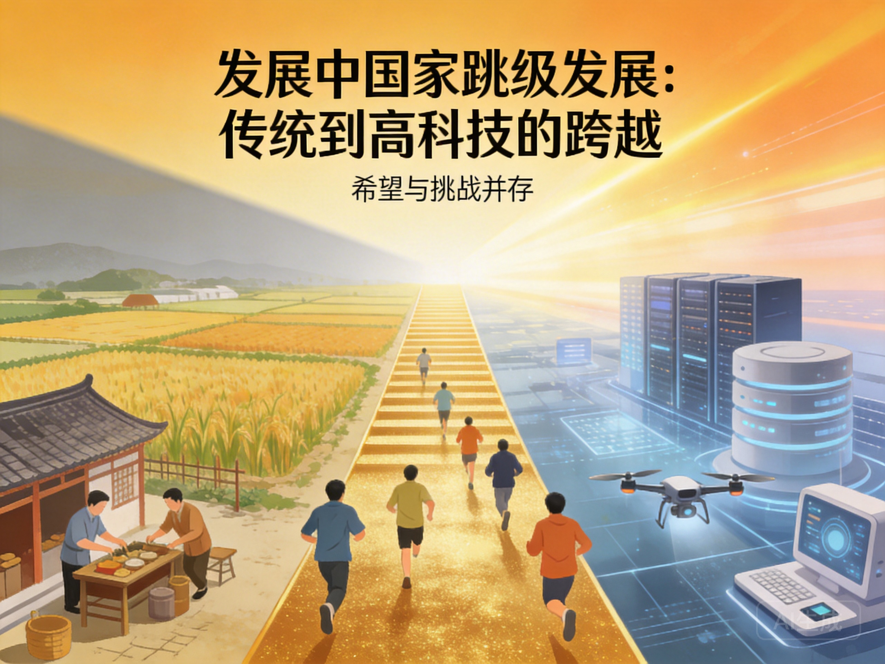

# 第14章 追赶者的困境：发展权的再定义

*跳跃发展：边缘国家能否跳过传统阶段，直接进入超级智能时代？*

## 14.1 技术扩散的门槛效应：被挡在门外？

传统发展模式假设技术会从领先国家向落后国家扩散。工业革命从英国扩散到欧洲，然后到美洲、亚洲。信息技术从美国扩散到全球。扩散需要时间，但最终会惠及所有人。

但超级智能可能不同。

### 门槛效应

超级智能需要巨大的前期投资：
- **数据中心**：数十亿美元的资本支出
- **人才**：全球顶尖的AI研究人员
- **数据**：海量的、高质量的训练数据

这些是许多国家无法负担的。就像核技术只有少数国家掌握，超级智能可能只集中在少数科技强国。

### 网络效应的锁定

AI系统越强大，使用它的人越多，它收集的数据越多，它就变得越强大。这种正反馈创造锁定——领先者越来越领先，追赶者越来越难以追赶。

**数据鸿沟**：
- 发达国家产生和消费大量数据
- 发展中国家产生数据，但数据被外国公司收集
- 结果是：发达国家有数据训练AI，发展中国家没有

**人才流失**：
- 全球顶尖的AI人才集中在少数国家和公司
- 发展中国家培养的人才被高薪吸引到中心
- 结果是：追赶者失去发展本土能力的机会

### 生态依赖

使用领先的AI平台意味着依赖其基础设施、标准、生态系统。这种依赖可能深化，使本地替代方案更难发展。

**例子**：
- 使用AWS、Azure意味着依赖美国的云基础设施
- 使用GPT、Gemini意味着依赖美国的技术标准
- 这种依赖不仅是技术的，也是经济的、政治的

结果是：超级智能时代可能不是扩散，而是分化。一些国家成为"AI核心"，另一些成为"AI边缘"。边缘国家不是简单地"落后"——它们可能永远没有机会追赶。

## 14.2 价值链锁定：永远的边缘？

即使边缘国家能够访问AI技术，它们可能被困在低价值链环节。

### 当前的全球分工

发达国家：
- 设计和制造高端芯片
- 开发AI算法和平台
- 提供高附加值服务

发展中国家：
- 组装电子产品
- 提供低成本的劳动力
- 消费技术产品

前者获取高附加值，后者获取低工资。

### AI可能强化这种分工

AI研发集中在少数地方，AI应用可能在任何地方。但应用不是研发——使用AI工具不等于创造AI技术。

**边缘国家的处境**：
- 永远是用户，而不是创造者
- 支付使用费，但不拥有知识产权
- 依赖中心国家的技术更新和维护

### 比较优势的消失

更糟糕的是，AI可能替代边缘国家的比较优势：
- 如果AI可以自动化制造业，发展中国家的低成本劳动力优势消失
- 如果AI可以提供服务，外包产业回流到发达国家
- 如果AI可以设计，"模仿-追赶"的路径被堵死

结果是：边缘国家可能失去发展的梯子，被锁定在永恒的依附地位。

*数据殖民：当边缘成为中心的原材料供应地*

## 14.3 基础设施投资的融资约束：钱从哪里来？

参与AI经济需要基础设施——电力、宽带、数据中心。这些投资是巨大的。

### 融资的困难

对于发达国家：
- 可以通过私人市场融资——有明确的回报预期
- 风险投资、企业投资、政府补贴

对于发展中国家：
- 风险更高，回报不确定
- 私人资本不愿进入
- 政府财政有限，其他优先事项（健康、教育、基础设施）竞争资金

### 国际发展援助的不足

传统援助关注基本需求——健康、教育、减贫。AI基础设施是新的需求，但援助机构可能还没有调整。

**援助的局限**：
- 资金规模有限——相对于AI投资的需求
- 条件限制——援助往往附加政治和经济条件
- 能力差距——受援国可能缺乏吸收和使用技术的能力

### 私人投资的条件

私人投资（如FDI）可能帮助，但：
- 投资者寻求回报，可能要求优惠政策
- 利润可能汇回母国，而不是本地再投资
- 技术转让可能有限——"技术黑箱"

结果是"数字鸿沟"的扩大。不是简单的有和无，而是质的差异——高质量连接 vs 低质量连接，本地数据中心 vs 依赖外国云，AI能力 vs 仅仅是消费AI。

## 14.4 伏笔：南南合作的新可能

但故事不是完全悲观的。超级智能时代也可能创造新的发展机会。

### 跳跃发展

边缘国家可以跳过传统发展阶段，直接采用最新的AI解决方案。

**历史先例**：
- 手机让一些国家跳过了固定电话基础设施
- 移动支付让一些国家跳过了传统银行系统

**AI时代的跳跃**：
- 直接采用AI医疗诊断，不需要建设传统医院网络
- 直接使用AI教育，不需要培训大量教师
- 直接采用AI农业建议，不需要传统的农业推广服务

### 分布式创新

开源AI、云计算、远程协作——这些让创新可以在任何地方发生。

**例子**：
- 一个小团队在印度或非洲，可以开发出世界级的AI应用
- 不需要硅谷的资源，只需要互联网连接和人才
- 本地问题的解决方案可能来自本地创新者，他们最理解本地情境

### 南南合作

边缘国家可以相互合作，共享技术、数据、最佳实践。

**合作的形式**：
- **技术共享**：共享开源AI工具和平台
- **数据合作**：建立区域数据共享机制，增加训练数据多样性
- **人才交流**：学生和研究人员交换，共同培养AI人才
- **联合标准**：制定适合发展中国家需求的AI伦理和安全标准

**优势**：
- 减少对外部（北方）的依赖
- 创造替代的发展路径
- 共享风险和成本

### 制度创新的机会

也许最重要的是，发展中国家可以实验新的制度安排——数据治理、AI伦理、人机协作。这些实验可能产生对全球都有价值的洞见。

**例子**：
- 爱沙尼亚的数字政府实验
- 卢旺达的无人机配送服务
- 这些" leapfrog"创新可能成为全球最佳实践

## 14.5 发展权的再定义：新的议程

面对这些挑战，"发展权"的概念需要更新。传统上，发展权主要指经济增长、工业化、生活水平提高。在超级智能时代，它可能需要包括：

### 技术主权

能够参与AI经济，不只是作为消费者，而是作为生产者和规则制定者。

**具体要求**：
- 本土AI研发能力
- 数据主权和控制
- 技术选择的自主权

### 数据权利

对自己产生的数据有控制权，能够从数据价值中获益。

**具体要求**：
- 数据可携带权
- 数据收益分享
- 防止数据殖民

### 教育转型

培养适应AI经济的能力，不只是技术技能，还有创造力、批判思维、人际关系能力。

**具体要求**：
- 从"知识传授"到"能力培养"
- 终身学习体系
- 全球教育资源的公平访问

### 社会保护

当AI替代传统工作，社会需要提供安全网、再培训、以及新的意义来源。

**具体要求**：
- 基本收入或类似机制
- 职业转换支持
- 心理健康和社会服务

### 全球合作的必要性

这些权利的实现需要全球合作：
- 不是施舍，而是真正的伙伴关系
- 共享技术、共享知识、共享治理
- 承认发展中国家的声音和利益

在下一部分，我们将面对最终的问题：2035年的分叉口，我们将如何选择？

---

*"发展不是单行道，而是多条路径的交汇。"*