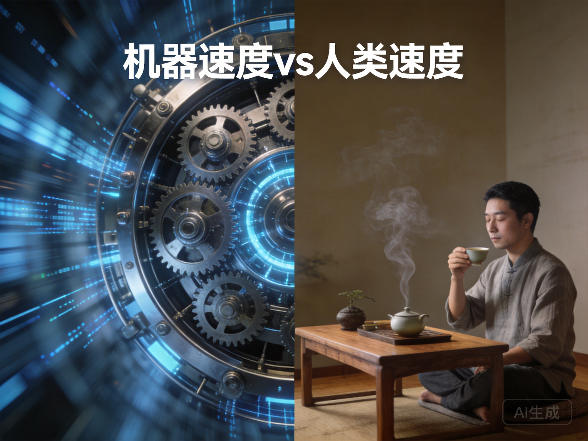

# 第二十七章：速度的差异——快与慢的全球辩证法

*高速列车与传统马车并行——物理速度的差异创造了不同的时间体验。数字世界的速度差异更加隐晦，却更加深刻。*

## 一、不同的时间表

林薇参与全球AI发展评估项目，发现一个惊人的事实：**不同国家以完全不同的速度发展AI**。

硅谷的公司：**月度更新**。算法每周训练，产品每月迭代。
中国深圳的企业：**双周迭代**。快速试错，快速调整。
欧洲的研究机构：**季度评估**。严谨测试，确保安全。
非洲的初创企业：**年度规划**。资源有限，稳步推进。

更深的差异在认知层面：
- **时间感**：硅谷的"当下未来"（未来已经到来，只是分布不均）vs 欧洲的"长期现在"（关注长期影响）
- **节奏感**：中国的"快速追赶"（弥补历史差距）vs 日本的"渐进完善"（追求质量完美）
- **优先序**：美国的"创新优先"（突破边界）vs 德国的"安全优先"（避免风险）

每个速度选择，都是**文化选择**。每个时间表，都是**价值表**。

## 二、核心问题：速度的辩证法

本章要回答的核心问题是：**在技术发展速度差异巨大的世界中，如何保持全球稳定与合作？东方"张弛有度"的智慧提供什么平衡之道？**

这不是技术问题，而是**时间哲学**问题。快与慢的关系是什么？如何协调不同的发展节奏？

## 三、速度的三个维度

### 技术采纳速度

新技术从出现到广泛采用的速度。例如：智能手机普及速度、社交媒体渗透速度、AI应用扩散速度。

**影响因素**：基础设施、经济能力、文化接受度、政策环境。

**差异现实**：发达国家可能几年内普及新技术，发展中国家可能需要十几年。

### 创新迭代速度

从创意到产品再到改进的循环速度。例如：软件更新频率、产品迭代周期、算法优化速度。

**影响因素**：研发投入、人才密度、竞争强度、失败容忍度。

**差异现实**：硅谷公司可能每周发布更新，传统行业可能每年一次大版本。

### 社会适应速度

社会制度、法律、教育、文化适应新技术的速度。例如：法律修订速度、教育体系更新速度、文化观念转变速度。

**影响因素**：制度弹性、社会共识、历史路径、风险意识。

**差异现实**：技术可能十年巨变，社会适应可能需要三十年。

## 四、东方智慧："张弛有度"

### 儒家的"时中"智慧

**《中庸》**："君子之中庸也，君子而时中。"

君子践行中庸之道，根据时机恰当行动。

"时中"意味着：\n- **适时**：在恰当的时间做恰当的事\n- **适度**：保持适度，不过度也不不及\n- **应时**：根据时机变化调整节奏

在速度问题中："时中"意味着**根据不同情境选择不同速度**。有时需要快，有时需要慢。关键是"恰当"。

### 道家的"快慢相成"

**《道德经》第二章**："有无相生，难易相成，长短相形，高下相倾，音声相和，前后相随。"

有和无互相生成，难和易互相成就，长和短互相显现，高和下互相依存，音和声互相和谐，前和后互相跟随。

快与慢也如此：\n- **相对性**：快相对于慢存在，慢相对于快存在\n- **互补性**：快与慢互相需要，互相成就\n- **转化性**：快可能转化为慢，慢可能转化为快

### "张弛有度"的应用

**不是一味求快，而是快慢结合**：\n- **战略节奏**：整体规划中快慢结合\n- **区域差异**：不同地区不同节奏\n- **领域区分**：不同领域不同速度\n- **阶段调整**：不同发展阶段不同重点

## 五、速度差异的挑战

### 技术殖民风险

快速发展国家可能通过技术优势形成新的殖民形式：数据殖民、算法殖民、平台殖民。

**例子**：全球社交媒体平台收集发展中国家数据，但利润回流发达国家。

### 发展断层加剧

速度差异导致"技术断层"：快速者越快速，慢速者越落后。断层难以跨越，形成永久性差距。

**例子**：AI芯片设计能力集中在少数国家，其他国家难以追赶。

### 全球风险扩散

快速发展的技术可能产生全球性风险（如自主武器、算法偏见），但全球治理跟不上技术速度。

**例子**：深度伪造技术快速发展，但全球监管严重滞后。

### 文化侵蚀加速

快速传播的技术产品可能侵蚀慢速地区的文化传统和生活方式。

**例子**：全球娱乐平台冲击本地文化产业。

## 六、协调机制：东方智慧的实践

### 多层次速度协调

**全球层**：建立最低安全标准和发展援助机制，确保慢速国家不被抛弃\n**区域层**：建立区域技术合作区，区内协调速度，区外保持差异\n**国家层**：制定国家技术发展战略，明确优先领域和节奏\n**企业层**：根据企业能力和市场选择适当速度

类似中国传统农业：\n- **节气**：全球性时间框架（播种、收获的季节）\n- **地域**：不同地区不同作物和耕作节奏\n- **农户**：每家根据自己情况调整

### 速度转换机制

**技术转移**：快速国家向慢速国家转移适用技术\n**能力建设**：帮助慢速国家建立技术能力，提高自身速度\n**风险管理**：快速国家承担更多风险监测和预警责任\n**收益共享**：技术收益公平分享，减少速度差异的不公平

### 时间缓冲设计

**技术沙盒**：允许新技术在有限范围内测试，减缓扩散速度\n**伦理审查**：新技术上线前的伦理审查期，确保安全\n**公众对话**：技术推广前的公众对话和共识形成过程\n**渐进部署**：分阶段部署，观察效果，调整策略

## 七、林薇的"节奏协调"实验

林薇在跨国AI合作项目中推动"节奏协调"方法。

### 实验设计

**三层速度框架**：\n1. **核心研发**：快速迭代（月度），前沿探索\n2. **应用开发**：中速推进（季度），产品化\n3. **社会部署**：慢速推广（年度），社会适应

**协调机制**：\n- **速度对话会**：定期讨论不同参与方的速度需求和约束\n- **能力匹配**：根据各方的能力分配不同速度的任务\n- **节奏同步点**：在关键节点同步进度，确保整体协调\n- **灵活调整**：根据情况动态调整速度

**实施案例**：医疗诊断AI全球部署

**核心研发**（美国、中国团队）：\n- 速度：月度算法更新\n- 任务：前沿算法研究、新疾病模型开发\n- 产出：研究论文、原型系统

**应用开发**（欧洲、日本团队）：\n- 速度：季度产品迭代\n- 任务：产品化、临床验证、合规适应\n- 产出：可部署系统、验证报告

**社会部署**（非洲、南亚团队）：\n- 速度：年度推广计划\n- 任务：本地化适配、医护人员培训、社区接受\n- 产出：本地化系统、培训材料、评估报告

### 挑战与发现

**挑战**：\n- **沟通困难**：不同速度团队沟通频率和方式差异\n- **预期管理**：快速度团队对慢速度团队的不耐烦\n- **资源分配**：如何公平分配资源和认可\n- **文化冲突**：不同速度背后的文化差异

**发现**：\n- **优势互补**：不同速度团队形成互补优势\n- **风险降低**：慢速部署减少大规模风险\n- **创新多元**：不同速度激励不同类型创新\n- **韧性增强**：多层次速度提高系统韧性

## 八、发展伦理的再思考

### 什么是正当的发展速度？

发展速度不仅关乎**技术可能**（我们能多快），更关乎**伦理应该**（我们应该多快）。

**伦理考量**：\n- **安全优先**：速度不应危及安全\n- **包容优先**：速度不应排除弱势群体\n- **可持续优先**：速度不应损害长期可持续性\n- **自主优先**：速度不应剥夺选择权

### 东方的速度伦理

不同于西方的**线性进步观**（越快越好，永远向前），东方智慧提供**循环平衡观**：

**四时循环**：春生、夏长、秋收、冬藏。每个季节有适当节奏，循环往复。\n- **生长期**：快速探索和实验\n- **成长期**：稳步发展和完善\n- **收获期**：评估和整合成果\n- **沉淀期**：反思和准备下一轮

**应用**：技术发展也应有"四季"，而非一味加速。

### 速度的选择权

发展速度不应是被强加的，而应是**自主选择的**。每个国家、每个社区应有权利选择适合自己的速度。

**自主选择的条件**：\n- **信息充分**：了解不同速度的利弊\n- **能力具备**：有能力实施选择的速度\n- **责任承担**：愿意承担选择的速度的后果\n- **可调整性**：可以根据情况调整速度

## 九、你的速度哲学

反思你对速度的态度：

1. **速度偏好**：你个人倾向于快节奏还是慢节奏？为什么？
2. **文化影响**：你的速度偏好如何受到文化背景影响？
3. **伦理考量**：对你而言，速度的伦理边界在哪里？
4. **实践平衡**：在工作中，你如何平衡快与慢的需求？

尝试一个练习：选择一个你参与或观察的技术发展案例（如社交媒体算法更新、自动驾驶技术推广、远程医疗应用），分析其速度模式：
- **实际速度**：发展实际速度如何？
- **理想速度**：你认为的理想速度应该是什么？
- **速度影响**：当前速度带来了什么正面和负面影响？
- **调整建议**：如何调整速度更合理？

## 十、张弛有度的世界

项目结束时，不同团队没有统一速度，但建立了**速度协调机制**。定期对话，互相理解，动态调整。

林薇发现：最可持续的发展，不是**最快的发展**，而是**最恰当的发展**。不是**单一速度**，而是**多元节奏**。

**《礼记·杂记下》**："张而不弛，文武弗能也；弛而不张，文武弗为也。一张一弛，文武之道也。"

只拉紧不放松，文王武王也做不到；只放松不拉紧，文王武王也不这样做。一张一弛，才是文王武王的原则。

在技术发展中，这意味着：\n- **快慢交替**：快速发展期与整合反思期交替\n- **领域差异**：不同技术领域不同速度\n- **时空差异**：不同地区、不同时间不同重点\n- **动态平衡**：根据情况动态调整快慢比例

这需要新的能力：\n- **节奏感**：感知和理解不同节奏的能力\n- **协调力**：协调不同节奏团队的能力\n- **耐心力**：在快节奏世界中保持耐心的能力\n- **时机感**：把握恰当时机的能力

回到不同的时间表。林薇现在看到：这不是**谁对谁错**，而是**不同选择**。不是**先进与落后**，而是**不同路径**。

**发展速度，最终是**我们想成为什么样的社会**的速度。**我们想要一个快速但可能脆弱的社会？还是慢速但可能落后的社会？还是一个快慢结合、张弛有度的社会？

东方的"张弛有度"提供第三条路：不是追求最快，而是追求**最恰当**。不是消除差异，而是**协调差异**。不是速度竞赛，而是**节奏艺术**。

速度差异不会消失。但随着技术加速，协调变得更加重要。我们需要的不只是技术专家，还是**时间哲学家**、**节奏艺术家**、**协调大师**。

因为每个速度选择，都是**生命质量**的选择。每个时间表，都是**我们如何生活**的表。

---

### 本章要点

1. **速度的三个维度**：技术采纳速度、创新迭代速度、社会适应速度——技术发展是复杂的速度系统。
2. **东方"张弛有度"智慧**：儒家的"时中"（适时适度）、道家的"快慢相成"（相对互补），提供速度平衡之道。
3. **速度差异的挑战**：技术殖民风险、发展断层加剧、全球风险扩散、文化侵蚀加速。
4. **协调机制实践**：多层次速度协调、速度转换机制、时间缓冲设计。
5. **林薇的"节奏协调"实验**：医疗AI项目的三层速度框架实践，挑战与发现。
6. **发展伦理再思考**：发展速度的伦理考量（安全、包容、可持续、自主），从技术可能到伦理应该。
7. **东方的速度伦理**：四时循环观取代线性进步观，技术发展的"四季"节奏。
8. **速度选择权**：发展速度应是自主选择的，需要信息充分、能力具备、责任承担、可调整性。
9. **速度哲学反思**：个人对速度的偏好、文化影响、伦理边界、实践平衡的自我认知。
10. **张弛有度的未来**：不是最快发展，而是最恰当发展；不是单一速度，而是多元节奏的艺术。

### 下章预告

速度差异的一个特殊表现是"追赶者"现象。当一些国家从后发位置追赶，它们发展出独特的创新模式。下一章，我们将探讨"追赶者的智慧"——发展中国家如何"后发先至"，以及东方"后来居上"的哲学。

---

*"祖父工厂的技术升级：有的设备要快换，提高效率；有的工艺要慢改，保证质量。他说：'升级不是比赛，是治疗。有的病要猛药快治，有的病要温药慢调。'"*

——林薇的日记，2037年1月